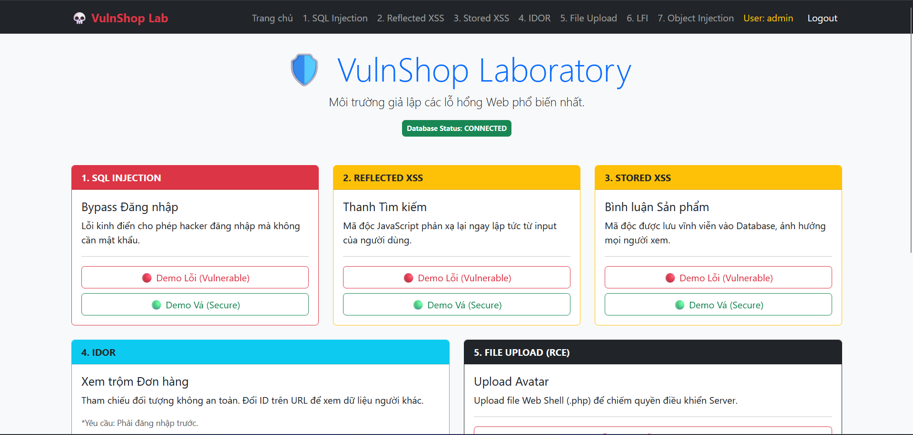

# 💀 VulnShop - Web Application Pentest Lab

**VulnShop** là một ứng dụng web được xây dựng có chủ đích với các lỗ hổng bảo mật nghiêm trọng (Deliberately Vulnerable App). Dự án được thiết kế để thực hành các kỹ thuật tấn công Web (Pentesting) và học cách vá lỗi (Secure Coding).



## 🚀 Tính năng nổi bật

- **Môi trường Docker:** Dễ dàng triển khai chỉ với 1 câu lệnh
- **Chế độ So sánh:** Tích hợp nút chuyển đổi nhanh giữa **Vulnerable Mode** (Lỗi) và **Secure Mode** (An toàn) để so sánh code
- **Dashboard:** Giao diện quản lý bài tập trực quan

## 🛠️ Công nghệ sử dụng

- **Backend:** PHP (Vanilla - Thuần)
- **Database:** MySQL
- **Frontend:** Bootstrap 5
- **Infrastructure:** Docker & Docker Compose

## 🎯 Danh sách lỗ hổng (Vulnerabilities)

1. **SQL Injection (SQLi):** Bypass đăng nhập Admin
2. **Reflected XSS:** Chèn mã độc vào thanh tìm kiếm
3. **Stored XSS:** Lưu mã độc vĩnh viễn vào bình luận
4. **IDOR (Insecure Direct Object References):** Xem trộm đơn hàng người khác
5. **Unrestricted File Upload:** Upload Web Shell chiếm quyền Server (RCE)
6. **Local File Inclusion (LFI):** Đọc file hệ thống nhạy cảm
7. **PHP Object Injection (POI):** Khai thác lỗi Deserialization để RCE

## ⚙️ Hướng dẫn Cài đặt & Sử dụng

### 1. Yêu cầu

- Đã cài đặt [Docker Desktop](https://www.docker.com/products/docker-desktop)

### 2. Cài đặt

Clone repo và khởi chạy container:

```bash
git clone https://github.com/your-username/vulnshop.git
cd vulnshop
docker-compose up -d --build
```

Sau khi chạy xong, truy cập trình duyệt tại: [http://localhost](http://localhost)

### 3. Tài khoản Mặc định

- **Admin:** admin / admin123
- **User thường:** victim / 123456

## ⚠️ Cảnh báo (Disclaimer)

Dự án này chứa các đoạn mã **KHÔNG AN TOÀN**. Tuyệt đối:

- **KHÔNG** upload code này lên hosting thực tế (Public Server)
- Chỉ chạy trong môi trường Local/Lab cách ly
- Tác giả không chịu trách nhiệm cho bất kỳ thiệt hại nào nếu sử dụng sai mục đích

---

*Developed by **hhhai** for Educational Purpose.*