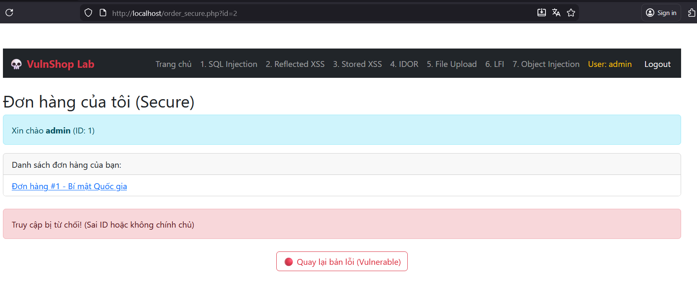

# Insecure Direct Object References (IDOR)

## 📋 Mô tả

Lỗ hổng tại trang Xem đơn hàng (`order.php`). Ứng dụng dùng tham số `id` trên URL để truy vấn đơn hàng nhưng không kiểm tra xem đơn hàng đó có thuộc về người đang đăng nhập hay không.


## ⚠️ Code Lỗi (Vulnerable)

```php
$order_id = $_GET['id'];
$sql = "SELECT * FROM orders WHERE id = $order_id"; // Thiếu check user_id
```

## 🎯 Cách Khai thác (Exploit)

1. Đăng nhập với tài khoản thường (victim)
2. Xem đơn hàng của mình, URL có dạng: `order.php?id=2`
3. Sửa URL thành: `order.php?id=1` (ID của Admin)
4. **Kết quả:** Xem được thông tin nhạy cảm của đơn hàng Admin


## 🔒 Cách Vá lỗi (Fix)

Thêm điều kiện kiểm tra chủ sở hữu (user_id) vào câu truy vấn:

```php
$stmt = $conn->prepare("SELECT * FROM orders WHERE id = ? AND user_id = ?");
$stmt->bind_param("ii", $order_id, $_SESSION['user_id']);
$stmt->execute();
$result = $stmt->get_result();
```
