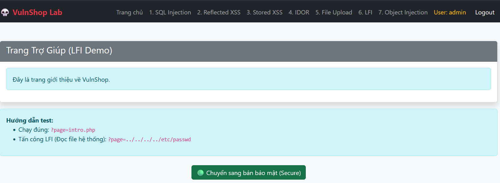
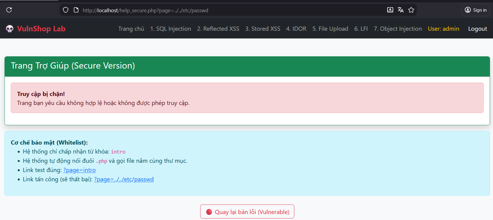

# Local File Inclusion (LFI)

## 📋 Mô tả

Lỗ hổng tại trang Help (`help.php`). Ứng dụng `include` trực tiếp file dựa trên tham số `page` mà không lọc các ký tự điều hướng thư mục (`../`).


## ⚠️ Code Lỗi (Vulnerable)

```php
$page = $_GET['page'];
include($page);
```

## 🎯 Cách Khai thác (Exploit)

1. Truy cập URL: `help.php?page=../../../../etc/passwd`
2. **Kết quả:** Đọc được nội dung file cấu hình user của hệ điều hành Linux
3. Có thể đọc source code file config: `help.php?page=config.php` (View Source để xem)


## 🔒 Cách Vá lỗi (Fix)

Sử dụng Whitelist (Danh sách được phép):

```php
$page = $_GET['page'];
$allowed = [
    'intro' => 'intro.php', 
    'contact' => 'contact.php',
    'about' => 'about.php'
];

if (array_key_exists($page, $allowed)) {
    include $allowed[$page];
} else {
    echo "Page not found!";
}
```
