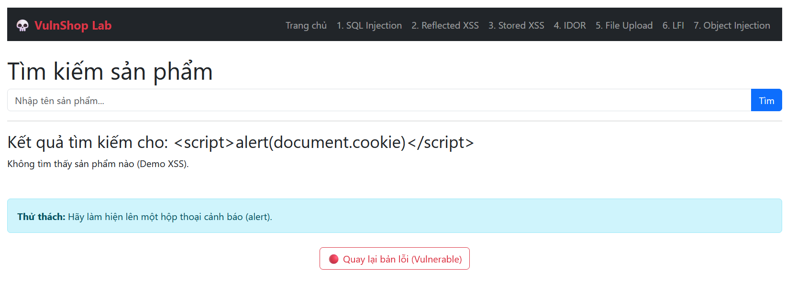

# Reflected Cross-Site Scripting (XSS)

## 📋 Mô tả

Lỗ hổng tại trang Tìm kiếm (`search.php`). Ứng dụng nhận từ khóa từ URL (`$_GET['q']`) và in ngay lập tức ra màn hình (`echo`) mà không mã hóa HTML.


## ⚠️ Code Lỗi (Vulnerable)

```php
echo "Kết quả tìm kiếm cho: " . $_GET['q'];
```

## 🎯 Cách Khai thác (Exploit)

1. Truy cập trang Tìm kiếm
2. Nhập từ khóa: `<script>alert(document.cookie)</script>`
3. **Kết quả:** Trình duyệt hiển thị Popup chứa Cookie của người dùng. Hacker có thể gửi link này cho nạn nhân để đánh cắp Session


## 🔒 Cách Vá lỗi (Fix)

Sử dụng hàm `htmlspecialchars()` để chuyển đổi ký tự đặc biệt thành HTML Entities:

```php
echo "Kết quả tìm kiếm cho: " . htmlspecialchars($_GET['q'], ENT_QUOTES, 'UTF-8');
```
