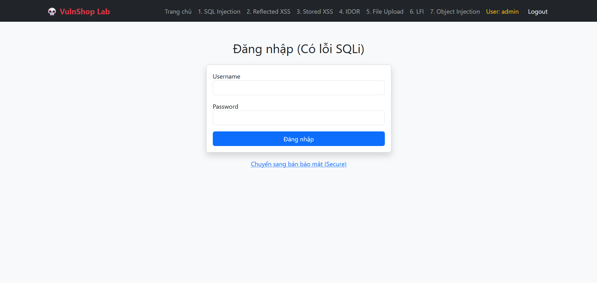
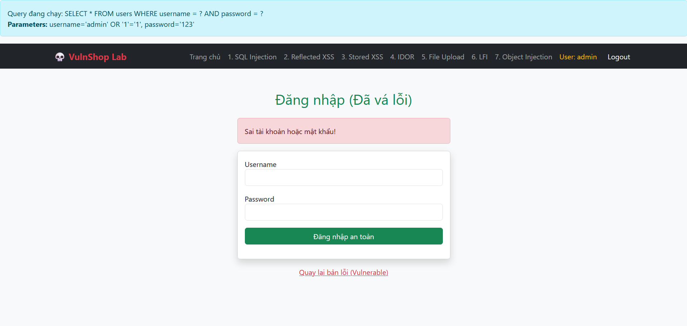

# SQL Injection (Login Bypass)

## 📋 Mô tả

Lỗ hổng xảy ra tại trang Đăng nhập (`login.php`). Ứng dụng ghép trực tiếp chuỗi input của người dùng vào câu lệnh SQL mà không qua bộ lọc.



## ⚠️ Code Lỗi (Vulnerable)

```php
$sql = "SELECT * FROM users WHERE username = '$username' AND password = '$password'";
```

## 🎯 Cách Khai thác (Exploit)

1. Truy cập trang Login
2. Nhập **Username:** `admin' OR '1'='1`
3. **Password:** Để trống hoặc nhập bất kỳ
4. **Kết quả:** Đăng nhập thành công với quyền Admin do điều kiện `OR '1'='1'` luôn đúng


## 🔒 Cách Vá lỗi (Fix)

Sử dụng Prepared Statements để tách biệt dữ liệu và câu lệnh SQL:

```php
$stmt = $conn->prepare("SELECT * FROM users WHERE username = ? AND password = ?");
$stmt->bind_param("ss", $username, $password);
$stmt->execute();
$result = $stmt->get_result();
```
