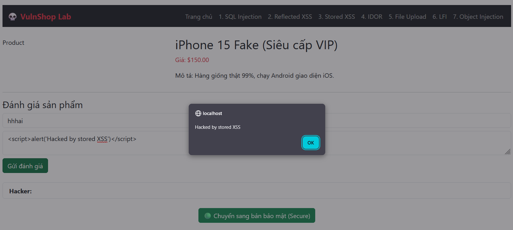

# Stored Cross-Site Scripting (XSS)

## 📋 Mô tả

Lỗ hổng tại trang Sản phẩm (`product.php`). Hacker bình luận mã độc, mã này được lưu vào Database. Bất kỳ ai (kể cả Admin) khi xem sản phẩm đều sẽ bị thực thi mã độc đó.


## ⚠️ Code Lỗi (Vulnerable)

```php
// Khi hiển thị comment từ Database
echo $row["comment_text"]; 
```

## 🎯 Cách Khai thác (Exploit)

1. Vào trang sản phẩm
2. Viết bình luận: `<script>alert('Hacked by stored XSS')</script>`
3. Gửi bình luận
4. F5 lại trang hoặc mở trình duyệt khác vào trang đó
5. **Kết quả:** Popup hiện lên vĩnh viễn mỗi khi trang được load


## 🔒 Cách Vá lỗi (Fix)

Mã hóa đầu ra (Output Encoding) khi hiển thị dữ liệu từ Database:

```php
echo htmlspecialchars($row["comment_text"], ENT_QUOTES, 'UTF-8');
```
